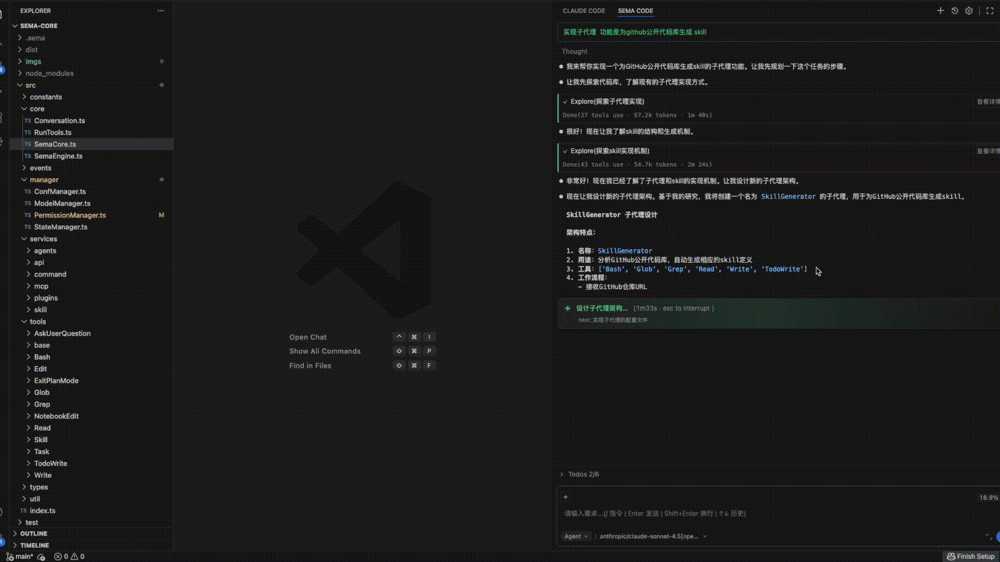

## 项目概述

**Sema Code VSCode Extension** 是基于 Sema Code Core 引擎的智能编程插件。

  

## 核心特性
- **自然语言指令** - 通过自然语言直接驱动编程任务
- **权限控制** - 细粒度的权限管理，确保操作安全可控
- **Subagent 管理** - 支持多智能体协同工作，可根据任务类型动态调度合适的子代理
- **Skill 扩展机制** - 提供插件化架构，可灵活扩展 AI 编程能力
- **Plan 模式任务规划** - 支持复杂任务的分解与执行规划
- **MCP 协议支持** - 内置 Model Context Protocol 服务，支持工具扩展
- **多模型支持** - 兼容 Anthropic、OpenAI SDK，支持国内外主流厂商 LLM API

## 安装与使用

1. 打开 Visual Studio Code  
2. 进入扩展视图 (`Ctrl+Shift+X`)  
3. 搜索 `Sema Code` 并点击安装  
4. 或从 [GitHub Releases](https://github.com/midea-ai/sema-code-vscode-extension/releases) 下载 VSIX 手动安装